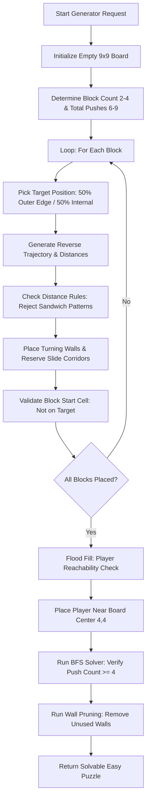

# Easy Puzzle Generator Architecture & Process

This document provides a detailed explanation of the procedural level generation pipeline used by **Block Down** to generate clean, solvable, high-quality **Easy Puzzles**.

---

## 🎯 Core Generator Philosophy: Reverse Construction

In Sokoban and ice-sliding puzzle games, forward random level generation often yields unsolvable boards, deadlocks, or trivial 1-move solves. 

To solve this, the **Easy Puzzle Generator** (`generateEasyPuzzle` / `generateReversePushPuzzle`) uses a **Goal-to-Start Reverse Push Construction** method:
1. Puzzles are built **backward**, starting from solved target positions.
2. Blocks are pulled in reverse away from their targets using sliding inertia physics.
3. Stopping walls are placed behind turns to justify block movements.
4. The generator validates that 100% of generated puzzles are **solvable** and require at least **4 block pushes** to solve.

---

## 📏 Grid & Puzzle Specifications

- **Grid Dimensions**: Strictly **9x9 grid** (`0 <= x < 9, y: 0 <= y < 9`).
- **Block Count**: **2 to 4 blocks** per puzzle.
- **Total Pushes**: **6 to 9 total pushes** allocated across all blocks.
- **Pushes Per Block**: **2 to 4 pushes** per block trajectory.
- **Color Palette**: Selected randomly from `red`, `blue`, `yellow`, `purple`, `green`, and `orange` (gray is excluded as it is reserved for static non-target obstacles).

---

## 🔄 Step-by-Step Generation Pipeline

### 1. Goal / Target Placement & Wall Reuse Strategy
For each block `bIdx` (up to 25 target attempts per block):
- **50% Wall Reuse**: Puzzles attempt to place new targets adjacent to pre-existing walls 50% of the time. This encourages blocks to share stopping obstacles and creates visually cohesive level layouts.
- **50/50 Outer Edge vs. Internal Target**:
  - **Outer Edge (50%)**: Target is placed on a board border cell (`y=0`, `y=8`, `x=0`, or `x=8`). The board boundary itself acts as the stopping wall.
  - **Internal Cell (50%)**: Target is placed inside the grid (`1 <= x, y <= 7`), and a stopping wall is placed directly behind it in the direction of forward motion.

---

### 2. Distance Pattern Validation ("No Sandwich" Rule)
The sliding distance for each reverse push step is chosen using `generateValidDistances` and checked against `isValidDistancePattern`:
- **Pattern Repetition Exclusion**: Sequences containing sandwich patterns such as `1-#-1`, `2-#-2`, `3-#-3`, `4-#-4`, or `#-1-#-1` are rejected to prevent repetitive back-and-forth sliding.
- **Allowed Patterns**: Adjacent duplicate distances (e.g. `4-4-1-2`, `5-5-1`, `2-2-1`) and varied sequences are permitted.

---

### 3. Turning Wall Selection & Slide Corridor Reservation
When a block changes direction at a turn (`pStep > 0`):
- Both candidate perpendicular directions are tested in random order.
- **Natural Obstacles**: If the cell behind the turn (`twPos`) is an outer grid boundary or an existing wall, no new wall needs to be built.
- **New Wall Placement**: If `twPos` is an open cell, a wall is placed provided it does not land on reserved slide corridors or occupied cells.
- **Corridor Reservation (`reservedSlideTiles`)**: All tiles along a block's reverse trajectory slide path are added to a reserved set. Subsequent blocks are forbidden from placing walls inside active slide corridors of previously generated blocks.

---

### 4. Block Starting Position & Target Overlap Prevention
- Once reverse pulling is complete for a block, its initial starting cell is set.
- **Strict Constraint**: A block must **NEVER** start on its own target cell or on any other block's target cell (`startsOnAnyTarget === false`). If a overlap occurs, the candidate block trajectory is discarded and retried.

---

### 5. Player Central Placement & Flood Fill Reachability
Once all blocks are placed:
1. **Push Tile Extraction**: The generator collects all required push origin tiles (`requiredPushTiles`) where the player must stand to execute the initial block pushes.
2. **Flood Fill Verification (`checkPlayerReachability`)**: A flood fill starting from potential player positions confirms that the player can walk to every required push tile without being trapped by walls or blocks.
3. **Central Placement**: Candidate open tiles are sorted by Manhattan distance from the board center `(4, 4)`. The player is placed at the open tile closest to the center that can reach all push locations.

---

### 6. BFS Solution Verification
The complete board layout is passed into `solvePuzzle` (a Breadth-First Search solver with full sliding inertia physics and portal simulation):
- Puzzles must be successfully solved by the BFS solver within node search limits.
- The optimal BFS solution must require **at least 4 block pushes** (`pushCount >= 4`).

---

### 7. Automated Wall Pruning (`pruneUnusedWalls`)
To maintain clean aesthetics and eliminate useless decor walls:
1. Every placed wall is tested one by one by temporary removal (`testWalls`).
2. The solver re-evaluates the puzzle without the candidate wall.
3. If the puzzle remains solvable in the **exact same optimal move count**, the wall is pruned as redundant.
4. If removing the wall creates an unintended shortcut or makes the puzzle unsolvable, the wall is kept.

---

## 💻 Source Code References

- **Core Generator & Solver Implementation**: [`src/client/utils/puzzleSolver.ts`](file:///c:/Users/owenu/Documents/game-dev/devvit-games/block-down/src/client/utils/puzzleSolver.ts)
- **Unit Test Suite**: [`src/client/utils/puzzleSolver.test.ts`](file:///c:/Users/owenu/Documents/game-dev/devvit-games/block-down/src/client/utils/puzzleSolver.test.ts)
- **Visual Editor Generator Integration**: [`src/client/dev.tsx`](file:///c:/Users/owenu/Documents/game-dev/devvit-games/block-down/src/client/dev.tsx)
