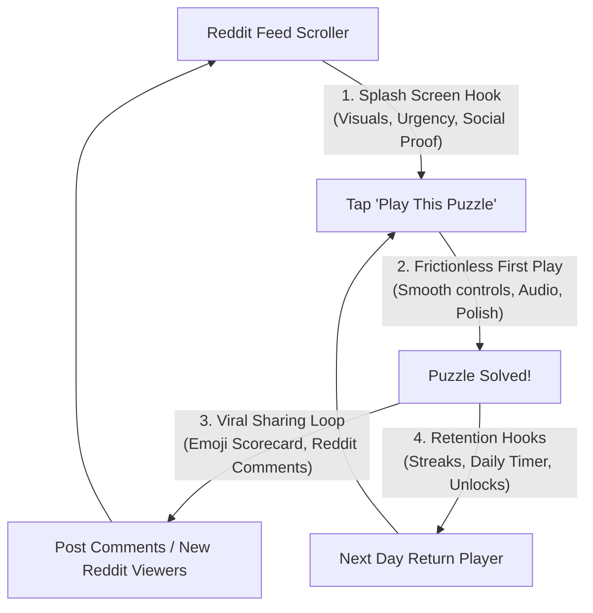

# Future Work & Strategic Roadmap: Viral Growth, Splash Hook & Game Polish

A reference document for upcoming growth, viral loops, splash screen conversion, and gameplay satisfaction initiatives for **Block-Down**.

---

## Growth & Conversion Funnel Analysis



To drive sustained growth and higher player counts, the application must excel at three inflection points:
1. **The Feed Hook (Splash Screen)**: Turning passive Reddit scrollers into active players in under 2 seconds.
2. **The Viral Feedback Loop**: Giving players a compelling, Wordle-like reason to comment and share their scores on Reddit.
3. **Retention & Progression**: Creating habitual daily return through streaks, podium rivalries, and cosmetic unlocks.

---

## Strategic Initiatives Breakdown

---

### Pillar 1: Splash Page Overhaul — The Ultimate Feed Hook

The splash screen (`src/client/splash.tsx`) is rendered inline inside the Reddit feed. It is your single most important conversion surface.

```
┌─────────────────────────────────────────────────────────────┐
│  [Campaign]             [Puzzle Maker]              [Shop]  │
├─────────────────────────────────────────────────────────────┤
│  🔥 4-Day Streak!                    ⏳ New Puzzle in 04:22:15│
│                      PUZZLE #42                             │
│       👑 Leader: u/Speedy (14 pushes) • 24/31 Solved (77%)   │
├─────────────────────────────────────────────────────────────┤
│                                                             │
│                [ Floating 3D Board Preview ]                │
│                 (Animated Auto-Play Solution)               │
│                                                             │
├─────────────────────────────────────────────────────────────┤
│         ▶ PLAY TODAY'S PUZZLE (EARN +50 COINS) ◀            │
│                 Tap to solve in expanded mode               │
└─────────────────────────────────────────────────────────────┘
```

#### Key Improvements:
1. **Dynamic Urgency & Countdown Timer**:
   - Add a live countdown clock: `⏳ Next Daily Puzzle in: HH:MM:SS`.
   - Creates fear-of-missing-out (FOMO) and informs the player that this puzzle is time-limited.
2. **Prominent Daily Streak Banner**:
   - If the player has an active streak: `🔥 5-Day Streak! Solve today to keep it burning!`
   - If streak is 0: `🔥 Start your Daily Streak today!`
   - Directly incentivizes clicking through to protect or begin their daily habit.
3. **Rivalry & Social Proof Teaser**:
   - Currently, the splash shows `X / Y Solved`. We can elevate this to high-engagement social proof:
     - `👑 Daily Leader: u/Username (12 pushes, 34s)`
     - `Difficulty: ⭐⭐⭐ (Medium) • Avg Time: 48s`
   - Gives players a concrete target to beat before they even tap play.
4. **High-Impact CTA Button Polish**:
   - Upgrade the "Play This Puzzle" button with a sleek animated shimmer sweep effect (`theme-btn-shimmer`), reward callout (`+50 Coins`), and pulsing focus.
5. **Floating Board Pedestal & Ambient Glow**:
   - Mount the auto-playing preview on a subtle dark glass pedestal with soft radial drop-shadows matching the active theme's palette, giving the preview a rich 2.5D physical presence.

---

### Pillar 2: Reddit-Native Viral Growth & Social Loops

Reddit players love showing off their problem-solving prowess and competing in threads.

#### Key Improvements:
1. **Wordle-Style Copyable Emoji Scorecard**:
   - When a puzzle is completed, generate a clean, copyable text block for Reddit comments:
     ```text
     Block-Down #42 📦🟩
     🎯 Pushes: 14 (⭐⭐⭐ Gold)
     ⏱️ Time: 0:41
     🌀 Portals Used: 2
     🟩🟩⬜🟩
     🟩🟨🟩🟩
     https://reddit.com/r/block_down_dev
     ```
   - One-tap "Copy to Clipboard" with a Reddit toast confirmation (`showToast` from `@devvit/web/client`).
2. **Direct-to-Comment Score Posting**:
   - In `post.ts`, the bot already creates a pinned `🏆 --SCORES--` comment thread on every daily post.
   - Provide a 1-tap in-game button: **"Post Score to Reddit Thread"** that automatically posts the player's scorecard as a reply under the pinned comment!
   - This floods the post comments with active discussion, boosting Reddit's algorithmic feed ranking and drawing more traffic to the game.
3. **Subreddit User Flair Integration**:
   - Automatically award or update Reddit user flairs in the subreddit for accomplishments:
     - `🔥 7-Day Streak`
     - `🥇 Daily Champion (3x)`
     - `🧩 Master Architect (Created 5 Puzzles)`
   - Gives active players status symbols visible across all Reddit threads in the community.
4. **"Challenge a Friend" Direct Links**:
   - When a user designs a puzzle in the Puzzle Maker, generate a custom challenge link with the creator's username:
     - *"Can you beat u/Username's 6x6 labyrinth?"*
   - Includes custom post flair (`Player Challenge`) and creator attribution.

---

### Pillar 3: Gameplay "Juice", Sound & Tactile Satisfaction

Great puzzle games like *Monument Valley* and *Baba Is You* hook players through micro-delights: every interaction feels crisp, weighty, and rewarding.

#### Key Improvements:
1. **Harmonic Musical Sound Effects (Web Audio Synthesizer)**:
   - When blocks slide into target destinations, play ascending musical chord notes (Root -> 3rd -> 5th -> Octave).
   - Solving the final block plays an energetic, uplifting victory chord fanfare.
2. **Target Destination Lock Particles**:
   - When a block lands on its destination:
     - Trigger a burst of particle sparks or shapes matching the block color (e.g. red heart particles, blue diamond crystals).
     - Micro-scale bounce animation on the destination tile (`scale-110 -> scale-100`).
3. **Speedrun / Move-Efficiency Medals (Par System)**:
   - Display a Par indicator on the in-game HUD:
     - 🥇 **Gold Star**: Optimal pushes (par)
     - 🥈 **Silver Star**: Par + 3
     - 🥉 **Bronze Star**: Completed
   - Replayability skyrockets when players know they solved it in 16 pushes, but the optimal solution is 12.
4. **Ghost Undo Trail**:
   - When a player pushes an undo, render a faint, brief trail showing the path the block slid back along, helping players understand their error and plan the next move.

---

### Pillar 4: Player Retention & Progression Hooks

#### Key Improvements:
1. **Streak Milestone Rewards**:
   - Reward continuous play with exclusive shop unlocks:
     - **3-Day Streak**: Unlock exclusive "Cyber Outrun" player trail.
     - **30-Day Streak** (1 Month): Unlock exclusive "Golden Mecha" orb character skin.
     - **60-Day Streak** (2 Months): Unlock "Ancient Relic" theme.
2. **Weekly Community Puzzle Spotlight on Splash**:
   - In addition to the Daily Puzzle, feature a rotating "Player Puzzle of the Week" created by community members in the Puzzle Maker.
   - Motivates players to build high-quality levels in the maker to get featured on the front page.
3. **Interactive Mini-Tutorial for First-Time Scrollers**:
   - For brand new players opening the game for the first time, offer an instant 3-step mini-level (1 block, 1 destination) before the main daily puzzle so they learn the sliding mechanic without frustration.

---

## Phased Implementation Roadmap Reference

| Phase | Initiative | Primary Benefit | Implementation Effort |
| :--- | :--- | :--- | :--- |
| **Phase 1** | **Splash Page Hook & Polish** (Streak banner, Countdown timer, Leader teaser, Shimmering CTA) | **High conversion from Reddit feed into game** | **Low–Medium** |
| **Phase 2** | **Viral Reddit Scorecard & Comment Integration** (Emoji grid, 1-tap reply to pinned comment) | **Organic Reddit algorithm boost & viral acquisition** | **Medium** |
| **Phase 3** | **Juice & Game Feel** (Destination lock particles, musical chord audio, Par efficiency rating) | **Significantly higher session duration & replayability** | **Medium** |
| **Phase 4** | **Progression & Reddit Flairs** (Streak milestone cosmetic rewards, automated user flairs) | **Long-term D7 / D30 player retention** | **Medium** |

---

## Detailed Implementation Plan: Phase 1 (Splash Page Hook & Polish)

### Objective
Maximize the conversion rate of passive Reddit feed scrollers into daily active puzzle solvers by optimizing the inline Devvit splash screen (`src/client/splash.tsx`).

### Technical Architecture & File Changes

```
┌─────────────────────────────────────────────────────────────┐
│  [Campaign]             [Puzzle Maker]              [Shop]  │
├─────────────────────────────────────────────────────────────┤
│  🔥 4-Day Streak!                    ⏳ New Puzzle in 04:22:15│
│                      PUZZLE #42                             │
│       👑 Leader: u/Speedy (14 pushes) • 24/31 Solved (77%)   │
├─────────────────────────────────────────────────────────────┤
│                                                             │
│         [ 2.5D Holographic Floating Board Pedestal ]        │
│                 (Animated Auto-Play Solution)               │
│                                                             │
├─────────────────────────────────────────────────────────────┤
│         ▶ PLAY TODAY'S PUZZLE (+100 SHARDS) ◀               │
│             (Shimmering sweep animation & glow)             │
└─────────────────────────────────────────────────────────────┘
```

#### 1. Server-Side Enrichment ([`src/server/trpc.ts`](file:///c:/Users/owenu/Documents/game-dev/devvit-games/block-down/src/server/trpc.ts))
- **Enrich `puzzle.getForPost`**:
  - In addition to `streak`, `totalCompletions`, and `isCompleted`, fetch the top entry from `getLeaderboard(puzzle.id)`.
  - Return `topLeader: { username: string, pushes: number, time: number } | null`.
  - Zero added round trips from client; delivers instantaneous social proof during initial splash payload.

#### 2. Visual Effects & Styles ([`src/client/index.css`](file:///c:/Users/owenu/Documents/game-dev/devvit-games/block-down/src/client/index.css))
- **Button Shimmer Animation**:
  - Add `@keyframes shimmer-sweep` and `.theme-btn-shimmer` to project styles.
  - Sweeps a translucent 45-degree light glint across the CTA every 3 seconds to catch the eye in the Reddit feed.
- **Floating Pedestal Backdrop**:
  - Add `.pedestal-frame` with radial theme glow, translucent glass backing (`bg-slate-950/60`), and smooth border radius to give the preview board depth.

#### 3. Inline Splash Screen Component ([`src/client/splash.tsx`](file:///c:/Users/owenu/Documents/game-dev/devvit-games/block-down/src/client/splash.tsx))
- **Live UTC Countdown Clock**:
  - Computes time remaining until midnight UTC (00:00:00 UTC) matching daily puzzle rollover.
  - Formats as `HH:MM:SS`. Pauses tick when tab is hidden via `visibilitychange`.
- **Daily Streak Banner**:
  - Active streak (`currentStreak > 0`):
    - Solved today: `🔥 X-Day Streak • Kept burning today! ✓`
    - Not yet solved: `🔥 X-Day Streak! Solve today to keep it burning!`
  - No active streak (`currentStreak === 0`): `🔥 Start your Daily Streak today!`
- **Leaderboard Social Proof Teaser**:
  - Displays `👑 Leader: u/Username (14 pushes, 34s)` or `👑 No solutions yet • Claim #1 spot!`.
- **CTA Polish**:
  - Adds `+100 Shards` / `+10 Shards` reward badge inside the primary launch button.
  - Interactive hover/focus pulse.

