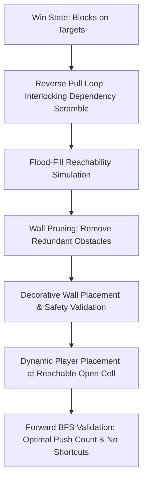

# Level Generation Rationale & Architecture (Puzzle Generator)

This document details the complete design rationale, architecture, gameplay constraints, algorithmic pipeline, and pseudocode for the **Block Down Procedural Puzzle Generator** (targeting moderate difficulty with interlocking block dependencies).

---

## 🎮 Page 1: Gameplay Functionality & Engine Requirements

To design an effective level generator, the procedural algorithm operates under strict engine constraints and universe mechanics defined by **Block Down**:

1. **The Grid**:
   - The game utilizes a finite **9x9 coordinate system** (`0 <= x < 9, 0 <= y < 9`).
   - This compact space limits the maximum number of simultaneous objects but allows for dense, tightly-packed logic puzzles.
2. **Ice-Slide Momentum Physics**:
   - The defining mechanic of the game: when a block is pushed by the player's core (the glowing cursor), it carries momentum and slides continuously in that direction.
   - A sliding block does **not** stop until it collides with a structural wall, board boundary, or another resting block.
3. **Objectives & Target Matching**:
   - The board contains neon block shapes and matching dashed target zones.
   - The win condition is met when **all blocks are resting on their corresponding target zones**.
4. **Player Movement & Navigation**:
   - The player controls a core that navigates grid-by-grid to reposition itself behind blocks for pushes.
   - The player must have open, reachable paths to maneuver around obstacles to push blocks from the required angles.
5. **Efficiency & Par System**:
   - Puzzles are scored on optimal completion in the fewest block pushes and moves possible, determining star ratings and leaderboard rankings.

### Generator Requirements
Any procedural generator must account for:
- **Reachability**: The player core's ability to navigate the board to reach push origin positions.
- **Solvability**: Guaranteeing that ice-slide physics do not trap blocks in dead states or unresolvable corners.
- **Collision Precision**: Accurately calculating stopping points, backboards, and sliding trajectories.

---

## 🧱 Page 2: Core Architecture & Reverse Construction

Rather than random forward placement (which leads to deadlocks or unresolvable states), the generator uses a **deterministic, mathematical reverse-push approach**:



1. **The Reverse-Push Algorithm**:
   - The generator begins at the **Win State** (all blocks placed on their targets).
   - It applies valid, legal **reverse pulls** to pull blocks backward along valid ice-slide trajectories away from targets into a scrambled **Start State**.
   - Pulling backward from an obstacle guarantees that in forward play, a push from the start point will collide and stop exactly at the target/turn.
2. **Flood-Fill Reachability**:
   - After every reverse-pull step, flood-fill pathfinding verifies the player core's movement.
   - The player core must have an open path to reach the tile behind the block to execute the forward push.
3. **Wall Pruning & Generation**:
   - Walls act as the brakes for ice-slide physics.
   - The generator places structural walls during turns and then prunes any walls that were never used as collision stopping points, ensuring an intentional, clutter-free board.

---

## 🧭 Page 3: Pathfinding, State Space Search & Distance Rules

To produce moderate complexity puzzles with predictable difficulty, the generator enforces state tracking and complexity constraints:

1. **State Space Search (Push-Only BFS)**:
   - When generating, a forward Breadth-First Search (BFS) evaluates the generated puzzle to ensure the intended path is the **optimal solution**.
   - **Optimization Rule**: The BFS solver only tracks the **number of block pushes**, not the player core's grid-by-grid steps. Evaluating every intermediate step would cause an exponential branching factor and freeze pathfinding in a near-infinite loop.
   - If the BFS discovers an unintended shortcut (e.g. fewer pushes than `COMPLEXITY_TARGET`), the puzzle is rejected.
2. **Distance Pattern Rules**:
   - If a block is only 1 space away from its target and requires 1 trivial push, complexity is zero.
   - The generator evaluates Manhattan distance and directional change counts, enforcing minimum thresholds.
   - **"No Sandwich" Rule**: Symmetrical back-and-forth distance sequences (e.g. `1-#-1`, `2-#-2`, `3-#-3`) are rejected to avoid repetitive patterns.

---

## 🧩 Page 4: Moderate Difficulty & Interlocking Block Reliance

Difficulty in Block Down puzzles stems from **interlocking block dependencies** rather than large board sizes:

1. **Interdependent Block-as-Wall Interactions**:
   - Because blocks slide until hitting an obstacle, blocks are intentionally programmed to **rely on one another to be solved**.
   - For Block A to reach Target A, Block B must first be pushed into a specific intersection to serve as a temporary backboard for Block A.
   - Once Block A comes to rest, Block B can then be pushed to its own destination.
   - In reverse generation, this is achieved by pulling Block B into position *before* pulling Block A.
2. **Target Zone Placement & Corner Mechanics**:
   - Target zones **can be placed adjacent to each other**.
   - **Corner & Edge Awareness**: When a target zone is placed in a corner or against an edge, a solved block resting on that target automatically acts as a permanent wall. The generator evaluates whether this creates intentional sequential dependencies (solving Block 1 first creates a backboard needed for Block 2) or trivializes the puzzle.
3. **Path Blocking & Traffic Jams**:
   - Placing target zones in tight corridors forces players to solve blocks in a strict sequence.
   - If Block C is placed on its target too early, it might block the corridor needed to maneuver the player core to push Block D.
   - The generator identifies choke points on the 9x9 grid to create sequential dependency requirements.

---

## 🌌 Page 5: Advanced Mechanics & Portals Note

1. **Portals Overview**:
   - Portals disrupt linear trajectories (entering Portal A exits Portal B while preserving momentum).
   - In graph pathfinding, portals act as connected spatial bridges.
2. **Procedural Scope Note**:
   - **Portal procedural generation is currently scrapped** for the core procedural generation pipeline to prioritize robust, deterministic sliding puzzles.
   - Portals remain fully supported in the custom puzzle engine and manually-designed campaign levels.

---

## ⚙️ Procedural Generation Logic (Verbal Pseudocode)

```text
Initialize the Board (Win State):
1. Create an empty 9x9 grid.
2. Place N Target zones on the grid (2 to 4 targets).
   - Adjacent targets are permitted.
   - Account for corner target placements where resting blocks become permanent backboards.
3. Place N corresponding Blocks directly on their Target zones.
   (Note: Portals are excluded from procedural generation).

Reverse-Pull Loop (Interlocking Scrambling Phase):
4. Define COMPLEXITY_TARGET (desired push count, e.g. 6 to 12 pushes).
5. WHILE (total_pulls < COMPLEXITY_TARGET) AND (valid_moves_exist):
     a. Pick a block (prioritize creating interlocking dependencies where one block
        serves as a backboard for another).
     b. Determine Valid Pull Directions:
        - To pull a block from Tile A to Tile B, there MUST be an obstacle
          (wall, board edge, or another resting block) directly adjacent to Tile A
          in the opposite direction (the backboard).
     c. Enforce Multi-Block Constraints:
        - Check the tile immediately behind proposed start Tile B in the forward
          push direction. If another block is sitting there, pull is INVALID
          (player cannot push a line of two blocks).
     d. Evaluate Player Reachability:
        - Run Flood-Fill search. Confirm the player core can navigate the board
          to stand on the push execution tile.
     e. If all checks pass:
        - Move the block to Tile B and increment total_pulls.

Wall Pruning:
6. Iterate through all placed structural walls.
7. If a wall was NEVER used as a collision backboard during reverse pulls,
   remove it to maintain a clean aesthetic.

Decorative Wall Placement:
8. Add a controlled number of extra structural walls randomly.
9. Validate decorative walls:
   - Ensure they do not alter or break puzzle solvability.
   - Ensure they do not block player access to required push tiles.
   - Ensure they do not obstruct active block slide paths.

Player Spawning:
10. The center tile (4,4) is NOT reserved. Dynamically place the player core at
    any valid open tile that has verified flood-fill reachability to all initial
    push execution positions.

Forward Validation (Solvability & Shortcut Elimination):
11. Run forward Breadth-First Search (BFS) from the final scrambled state to the Win State.
12. Verify that optimal push count == COMPLEXITY_TARGET and that required block
    interlocking dependencies are preserved.
    If an unintended shortcut exists, discard and restart generation.
```

---

## 💻 Source Code Integration & Client-Side Dev Panel

- **Client-Side Dev Panel Integration**: Exposed in the Dev Panel (`src/client/dev.tsx`) within the Visual Grid Editor for on-demand procedural generation.
- **Core Generator & Solver Implementation**: [`src/client/utils/puzzleSolver.ts`](file:///c:/Users/owenu/Documents/game-dev/devvit-games/block-down/src/client/utils/puzzleSolver.ts)
- **Unit Test Suite**: [`src/client/utils/puzzleSolver.test.ts`](file:///c:/Users/owenu/Documents/game-dev/devvit-games/block-down/src/client/utils/puzzleSolver.test.ts)
