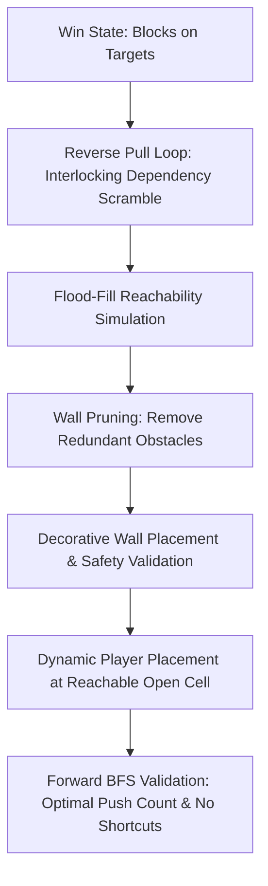

# Level Generation Rationale & Architecture (Puzzle Generator)

This document details the complete design rationale, architecture, gameplay constraints, algorithmic pipeline, and pseudocode for the **Block Down Procedural Puzzle Generator** (targeting moderate difficulty with interlocking block dependencies).

---

## 🎮 Page 1: Gameplay Functionality & Engine Requirements

To design an effective level generator, the procedural algorithm operates under strict engine constraints and universe mechanics defined by **Block Down**:

1. **The Grid**:
   - The game utilizes a finite **9x9 coordinate system** (`0 <= x < 9, 0 <= y < 9`).
   - This compact space limits the maximum number of simultaneous objects but allows for dense, tightly-packed logic puzzles.
2. **Ice-Slide Momentum Physics**:
   - The defining mechanic of the game: when a block is pushed by the player's core (the glowing cursor), it carries momentum and slides continuously in that direction.
   - A sliding block does **not** stop until it collides with a structural wall, board boundary, or another resting block.
3. **Objectives & Target Matching**:
   - The board contains neon block shapes and matching dashed target zones.
   - The win condition is met when **all blocks are resting on their corresponding target zones**.
4. **Player Movement & Navigation**:
   - The player controls a core that navigates grid-by-grid to reposition itself behind blocks for pushes.
   - The player must have open, reachable paths to maneuver around obstacles to push blocks from the required angles.
5. **Efficiency & Par System**:
   - Puzzles are scored on optimal completion in the fewest block pushes and moves possible, determining star ratings and leaderboard rankings.

### Generator Requirements
Any procedural generator must account for:
- **Reachability**: The player core's ability to navigate the board to reach push origin positions.
- **Solvability**: Guaranteeing that ice-slide physics do not trap blocks in dead states or unresolvable corners.
- **Collision Precision**: Accurately calculating stopping points, backboards, and sliding trajectories.

---

## 🧱 Page 2: Core Architecture & Reverse Construction

Rather than random forward placement (which leads to deadlocks or unresolvable states), the generator uses a **deterministic, mathematical reverse-push approach**:


```mermaid
flowchart TD
    A[Win State: Blocks on Targets] --> B[Reverse Pull Loop: Interlocking Dependency Scramble]
    B --> C[Flood-Fill Reachability Simulation]
    C --> D[Wall Pruning: Remove Redundant Obstacles]
    D --> E[Decorative Wall Placement & Safety Validation]
    E --> F[Dynamic Player Placement at Reachable Open Cell]
    F --> G[Forward BFS Validation: Optimal Push Count & No Shortcuts]
```

1. **The Reverse-Push Algorithm**:
   - The generator begins at the **Win State** (all blocks placed on their targets).
   - It applies valid, legal **reverse pulls** to pull blocks backward along valid ice-slide trajectories away from targets into a scrambled **Start State**.
   - Pulling backward from an obstacle guarantees that in forward play, a push from the start point will collide and stop exactly at the target/turn.
2. **Flood-Fill Reachability**:
   - After every reverse-pull step, flood-fill pathfinding verifies the player core's movement.
   - The player core must have an open path to reach the tile behind the block to execute the forward push.
3. **Wall Pruning & Generation**:
   - Walls act as the brakes for ice-slide physics.
   - The generator places structural walls during turns and then prunes any walls that were never used as collision stopping points, ensuring an intentional, clutter-free board.

---

## 🧭 Page 3: Pathfinding, State Space Search & Distance Rules

To produce moderate complexity puzzles with predictable difficulty, the generator enforces state tracking and complexity constraints:

1. **State Space Search (Push-Only BFS)**:
   - When generating, a forward Breadth-First Search (BFS) evaluates the generated puzzle to ensure the intended path is the **optimal solution**.
   - **Optimization Rule**: The BFS solver only tracks the **number of block pushes**, not the player core's grid-by-grid steps. Evaluating every intermediate step would cause an exponential branching factor and freeze pathfinding in a near-infinite loop.
   - If the BFS discovers an unintended shortcut (e.g. fewer pushes than `COMPLEXITY_TARGET`), the puzzle is rejected.
2. **Distance Pattern Rules**:
   - If a block is only 1 space away from its target and requires 1 trivial push, complexity is zero.
   - The generator evaluates Manhattan distance and directional change counts, enforcing minimum thresholds.
   - **"No Sandwich" Rule**: Symmetrical back-and-forth distance sequences (e.g. `1-#-1`, `2-#-2`, `3-#-3`) are rejected to avoid repetitive patterns.

---

## 🧩 Page 4: Moderate Difficulty & Interlocking Block Reliance

Difficulty in Block Down puzzles stems from **interlocking block dependencies** rather than large board sizes:

1. **Interdependent Block-as-Wall Interactions**:
   - Because blocks slide until hitting an obstacle, blocks are intentionally programmed to **rely on one another to be solved**.
   - For Block A to reach Target A, Block B must first be pushed into a specific intersection to serve as a temporary backboard for Block A.
   - Once Block A comes to rest, Block B can then be pushed to its own destination.
   - In reverse generation, this is achieved by pulling Block B into position *before* pulling Block A.
2. **Target Zone Placement & Corner Mechanics**:
   - Target zones **can be placed adjacent to each other**.
   - **Corner & Edge Awareness**: When a target zone is placed in a corner or against an edge, a solved block resting on that target automatically acts as a permanent wall. The generator evaluates whether this creates intentional sequential dependencies (solving Block 1 first creates a backboard needed for Block 2) or trivializes the puzzle.
3. **Path Blocking & Traffic Jams**:
   - Placing target zones in tight corridors forces players to solve blocks in a strict sequence.
   - If Block C is placed on its target too early, it might block the corridor needed to maneuver the player core to push Block D.
   - The generator identifies choke points on the 9x9 grid to create sequential dependency requirements.

---

## 🌌 Page 5: Advanced Mechanics & Portals Note

1. **Portals Overview**:
   - Portals disrupt linear trajectories (entering Portal A exits Portal B while preserving momentum).
   - In graph pathfinding, portals act as connected spatial bridges.
2. **Procedural Scope Note**:
   - **Portal procedural generation is currently scrapped** for the core procedural generation pipeline to prioritize robust, deterministic sliding puzzles.
   - Portals remain fully supported in the custom puzzle engine and manually-designed campaign levels.

---

## ⚙️ Procedural Generation Logic & Performance Architecture

```text
Initialize the Board (Win State):
1. Create an empty 9x9 grid.
2. Place N Target zones across balanced quadrants & perimeter edges (2 to 4 targets).
3. Place N corresponding Blocks directly on their Target zones.

Hierarchical DFS Backtracking Scramble:
4. For each block, execute a depth-first reverse search (DFS stack):
   a. Identify candidate runways in reverse directions with valid backboards (walls, edges, or resting blocks).
   b. Push-Tile Reservation: Reserve the tile behind each forward push direction so subsequent walls never block player execution corridors.
   c. If a candidate perpendicular runway or player push tile is blocked, backtrack one step along the DFS stack rather than restarting the entire board.
   d. Pull backward with sweeping slide distances (2 to 6 tiles).

Anti-Shortcut Baffle Placement:
5. Check line-of-sight between block start positions and targets to prevent trivial 1-push solutions.

Player Spawning & Forward BFS Verification:
6. Identify all connected floor components via flood fill.
7. Run Push-BFS solver to verify shortest path push count and solvability.

Single-Pass Trace Wall Pruning & Candidate Ranking:
8. Extract walls actually contacted during the solution trajectory trace (stoppedBy: 'wall').
9. Batch prune unused walls in a single verification pass.
10. Calculate composite candidate quality score Q = f(pushes, collisions, switches, avgDist, walls). Return best candidate with 0% fallback rate.
```

---

## 💻 Source Code Integration & Client-Side Dev Panel

- **Client-Side Dev Panel Integration**: Exposed in the Dev Panel (`src/client/dev.tsx`) within the Visual Grid Editor for on-demand procedural generation.
- **Core Generator & Solver Implementation**: [`src/client/utils/puzzleSolver.ts`](file:///c:/Users/owenu/Documents/game-dev/devvit-games/block-down/src/client/utils/puzzleSolver.ts)
- **Unit Test Suite**: [`src/client/utils/puzzleSolver.test.ts`](file:///c:/Users/owenu/Documents/game-dev/devvit-games/block-down/src/client/utils/puzzleSolver.test.ts)
- **Sample Generation Script**: [`src/client/utils/generateSamples.test.ts`](file:///c:/Users/owenu/Documents/game-dev/devvit-games/block-down/src/client/utils/generateSamples.test.ts)

